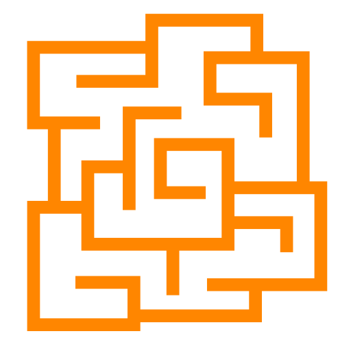

<div id="top"></div>

<br />
<div align="center">
  <a href="https://github.com/babakjalilian/Read_Me_Test">
    
  </a>

<h3 align="center">Pipes Puzzle</h3>

  <p align="center">
    Pipes Puzzle is a great game to kill time while training your brain!
    <br />
    <a href="https://babakjalilian.github.io/pipes-puzzle/">View Demo</a>
    ·
    <a href="https://github.com/babakjalilian/Read_Me_Test/issues">Report Bug</a>
    ·
    <a href="https://github.com/babakjalilian/Read_Me_Test/issues">Request Feature</a>
  </p>
</div>

<!-- TABLE OF CONTENTS -->
<details open>
  <summary>Table of Contents</summary>
  <ol>
    <li>
      <a href="#about-the-project">About the Project</a>
      <ul>
        <li><a href="#built-with">Built With</a></li>
      </ul>
    </li>
    <li>
      <a href="#getting-started">Getting Started</a>
      <ul>
        <li><a href="#prerequisites">Prerequisites</a></li>
        <li><a href="#installation">Installation</a></li>
        <li><a href="#linttest">Lint/Test</a></li>
        <li><a href="#builds-the-app-for-production-github-actions">Builds the App for Production</a></li>
      </ul>
    </li>
    <li>
      <a href="#details">Deatils</a>
      <ul>
        <li><a href="#level-passwords">Level Passwords</a></li>
        <li><a href="#known-limitations-of-the-solution">Known Limitations of the Solution</a></li>
        <li><a href="#key-design-decisions-ive-made">Key Design Decisions I've Made</a></li>
      </ul>
    </li>
    <li><a href="#Contact">Contact</a></li>
  </ol>
</details>

## About the Project

[![Product Name Screen Shot][product-screenshot]](https://github.com/babakjalilian/Read_Me_Test/blob/main/public/pipe-puzzle-cover.png)

Pipes puzzle also known as FreeNet is a logic puzzle with simple rules and challenging solutions that allows you to keep problem-solving skills in training. The goal of the puzzle is to rotate the tiles on the map to make all pipes connected in a single group, with no loops and no dangling pipes. Click a tile with the mouse to rotate it. Once you have created a valid puzzle you can go to the next round. There are 6 levels available, with increasing size and thus increasing complexity.

### Built With

- [React.js](https://reactjs.org/)
- [TypeScript](https://typescriptlang.org/)
- [React Redux](https://react-redux.js.org/)
- [Redux Toolkit](https://redux-toolkit.js.org/)

  <p align="right">(<a href="#top">back to top</a>)</p>

## Getting Started

This is an example of how you may give instructions on setting up your project locally.
To get a local copy up and running follow these simple example steps.

### Prerequisites

We use [npm](https://www.npmjs.com/) to manage the dependencies, so we recommend using it to you too.

- npm
  ```sh
  npm install npm@latest -g
  ```

### Installation

1. Clone the repo
   ```sh
   git clone https://github.com/babakjalilian/Read_Me_Test.gitaa
   ```
2. Navigate into the local repository and install NPM packages (might take a few minutes).

   ```sh
   npm install
   ```

3. Run `npm run start` for a dev server. Navigate to `http://localhost:3000/pipes-puzzle/`. The app will automatically reload if you change any of the source files. You will also see any lint errors in the console.

### Lint/Test

There is only a few tests due to lack of time. Core functionalities have tests written for them. (Others, WIP)

```sh
# lint
npm run lint

# test
npm run test
```

### Builds the App for Production (GitHub Actions)

This repository is using GitHub Actions for the build and deployment.
(From `main` to the `github-pages` branch.)

<p align="right">(<a href="#top">back to top</a>)</p>

## Details

### Level Passwords

level 1 : JustWarmingUp;

level 2 : DefinitelyWarm;

level 3 : ❌

level 4 : ❌

level 5 : ❌

level 6 : ❌

### Known Limitations of the Solution

Due to the heavy load and high number of cells in levels 5 and 6, the UX is not as smooth as other levels. Optimization has minimized lagging, but not completely removed it.

### Key Design Decisions I've Made

- In levels 5 and 6, with high number of cells, some performance and rendering issues emerged. They were optimized using React Virtualized Package.

- To reduce server calls and, hence, optimize server load, rotations are handled on the client side as queues. Every 50 rotation (50 is adjustable to any number in the code), the rotations are synced with the server under a single request in the background and without involving the user or disturbing the flow of the game.

The other advantage is that in higher levels where the server takes a bit longer to respond, the user faces no lagging in rotations and doesn’t have to wait after each rotation they make to a cell.

- The queued rotations are analyzed before syncing with the server and if one cell is rotated 4 times, which means it is back to its start position, its rotations are deleted. This further optimizes the requests sent to the server.

<p align="right">(<a href="#top">back to top</a>)</p>

## License

Distributed under the MIT License. See `LICENSE.txt` for more information.

<p align="right">(<a href="#top">back to top</a>)</p>

## Contact

### Babak Jalilian

Email: babakjalilian1990@gmail.com

LinkedIn: https://www.linkedin.com/in/babak-jalilian/

<p align="right">(<a href="#top">back to top</a>)</p>

<!-- MARKDOWN LINKS & IMAGES -->
<!-- https://www.markdownguide.org/basic-syntax/#reference-style-links -->

[product-screenshot]: public/pipe-puzzle-cover.png
